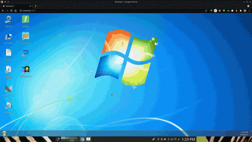

<div align="center">
  
  <h1>Windows 7 on the web</h1>
  <p>A Windows 7 desktop that runs in the browser, built with Vue 3 and Vite.</p>
  
</div>

Based on [nainemom/win7](https://github.com/nainemom/win7) by Amir Momenian
(Apache License 2.0, see `LICENSE`), with these additions:

| Feature | What it does |
|---|---|
| **Command Prompt** | A real command line: `help`, `dir`, `cd`, `type`, `tree`, `start`, `echo`, `date`, `time`, `cls`, `ver`, drive switching (`D:`). Windows-style paths, case-insensitive names, ↑/↓ history, Tab completion, Ctrl+L to clear. Replaces the original, which ran typed text as JavaScript. |
| **Recycle Bin** | Delete moves files to the Recycle Bin (desktop icon shows empty/full). Inside it: Restore, Delete permanently, Restore all, Empty the Recycle Bin. |
| **Explorer navigation** | Back, Forward and Up buttons, an address bar you can type a path into (`C:\User\Documents`), and an item count. |
| **Control Panel** | Personalization (desktop background), Desktop Gadgets, System info, Programs, Recycle Bin, Command Prompt, and **Reset this PC**. |
| **Saved files** | New folders and text files, renames, moves, edits and the Recycle Bin are remembered in this browser. Reset this PC brings back the original files. |
| **Desktop gadgets** | Clock, Calendar and CPU Meter on the right side of the desktop, like Windows 7. See below. |

Open the Command Prompt and Control Panel from the Start menu or the desktop.

## Desktop gadgets

The Clock, Calendar and CPU Meter sit on the right side of the desktop, above
the wallpaper and icons and below windows.

- **Clock**: an analog clock with a second hand. Its options (the wrench
  button) set a name shown on the face, a time zone and whether the second
  hand is shown.
- **Calendar**: today's day, date and month. Click it for the month view, use
  the arrows to change month, click a day to see it, click the month title to
  go back to today.
- **CPU Meter**: a look-alike of the Windows 7 gadget. The browser cannot see
  the real CPU, so the left dial estimates how busy the page is and the right
  dial shows how much memory its scripts use (where the browser reports it).

Drag a gadget to move it. Point at it to show its toolbar (close, options,
drag handle), or right-click it. To add gadgets, right-click the desktop and
choose **Gadgets**, or open **Control Panel → Desktop Gadgets** or **Desktop
Gadget Gallery** in the Start menu, then double-click a gadget or click
**Add**. You can add more than one of each.

Which gadgets are open, where they are and their options are saved in this
browser (`localStorage` key `win7-gadgets-v1`); **Reset this PC** clears them.
Day and month names follow the browser's language. With a Vietnamese browser
(`vi`), the calendar starts weeks on Monday and uses T2–CN. On screens
narrower than 600 px the gadgets are drawn at 70% size, and only the Clock
and Calendar are shown at first.

## Run it locally

```bash
npm ci
npm run dev      # start with hot reload
npm run build    # production build in dist/
npm run lint
```

## Deploying

`.github/workflows/pages.yml` builds the site and publishes it to GitHub
Pages on every push to `main`. In the repository settings, set
**Pages → Source** to **GitHub Actions** once.

## Media files

The original demo songs and video in `D:` are not included because they are
copyrighted. Put your own `.mp3` files in `src/D:/Musics` and `.mp4` files in
`src/D:/Videos` to have them appear in the music and video players.

## History

The previous version of this fork was lost when its GitHub account was
suspended; notes from that recovery are in `docs/recovery/`. The features
listed in `docs/recovery/CUSTOM_CHANGES.md` were rebuilt here, including the
Gadgets Gallery with Clock and Calendar.
